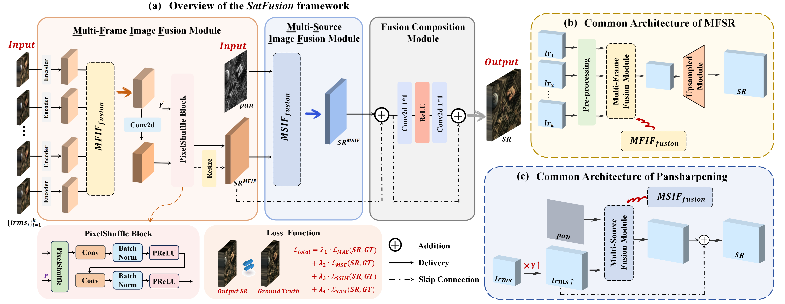

# 🌍 SatFusion / SatFusion*: A Unified Framework for Enhancing Remote Sensing Images via Multi-Frame and Multi-Source Fusion

> Official Implementation of **SatFusion** and its enhanced variant **SatFusion***  
> **SatFusion: A Unified Framework for Enhancing Remote Sensing Images via Multi-Frame and Multi-Source Image Fusion**
---

## 🛰️ Overview
**SatFusion** is a unified deep learning framework for enhancing remote sensing imagery by jointly fusing **Multi-Frame** and **Multi-Source** data.

Unlike existing approaches that treat **Multi-Frame Super-Resolution (MFSR)** and **Pansharpening** as separate tasks, SatFusion integrates both into a single end-to-end architecture, enabling improved **reconstruction quality, robustness, and generalization**.

**SatFusion*** is an enhanced variant of SatFusion that further improves robustness under **temporal misalignment and real-world degradations** by incorporating **PAN-guided multi-frame feature encoding**.



---

## 🔬 Key Features
- **Unified Fusion Framework** — Joint multi-frame and multi-source optimization within a single architecture  
- **Multi-Temporal Image Fusion (MTIF)** — Aggregates complementary information from multiple LRMS frames  
- **Multi-Source Image Fusion (MSIF)** — Injects fine-grained spatial details from high-resolution PAN images  
- **Fusion Composition Module** — Adaptive feature fusion with residual connections and spectral refinement  
- **SatFusion*** — PAN-guided multi-frame encoding for enhanced robustness to misalignment and noise
---

## 🧩 Architecture
SatFusion consists of three core modules.  
SatFusion* follows the same overall architecture, with an enhanced PAN-guided design in the multi-temporal fusion stage.

### 1. Multi-Temporal Image Fusion (MTIF)
- **Inputs:** multiple LRMS images  
- **Outputs:** temporally enhanced MS features  
- **Implementation:** shared encoders, feature aggregation, and PixelShuffle-based decoding  
- **SatFusion\*:** incorporates PAN-guided feature encoding to improve temporal alignment and stability
### 2. Multi-Source Image Fusion (MSIF)
- **Inputs:** MTIF output + high-resolution PAN image  
- **Outputs:** spatially enhanced MS feature map  
- **Implementation:** PAN-guided spatial detail injection following pansharpening principles
### 3. Fusion Composition Module
- Combines multi-temporal and multi-source features  
- Employs residual connections and 1×1 convolutions for adaptive spectral balancing
---

## 🌍 Dataset
We conduct experiments on the WorldStrat, WV3, QB, and GF2 datasets.
The complete WorldStrat dataset can be downloaded from [https://worldstrat.github.io/](https://worldstrat.github.io/), while the WV3, QB, and GF2 datasets are available at [https://liangjiandeng.github.io/PanCollection.html](https://liangjiandeng.github.io/PanCollection.html).

This repository provides the **complete experimental pipeline** for the **WorldStrat** dataset.  
For the **WV3, QB, and GF2** datasets, we provide the **core implementation**, including the model architecture and training configurations, which are implemented based on the **DLPan-Toolbox** framework  
([https://github.com/liangjiandeng/DLPan-Toolbox.git](https://github.com/liangjiandeng/DLPan-Toolbox.git)).


## ⚙️ Quick Start

### 🛰️ WorldStrat Dataset
This section describes the complete training, validation, and testing pipeline for the **WorldStrat** dataset.

#### 📁 Code Architecture for the Worldstrat Dataset
```
code_worldstrat/
├── requirements.txt
├── Train_Val_Test.py
├── train.py
├── Inference.py
└── src/
    ├── __init__.py
    ├── datasets.py
    ├── datasources.py
    ├── lightning_modules.py
    ├── loss.py
    ├── modules.py
    ├── plot.py
    ├── train.py
    ├── transforms.py
    ├── misr/
    │   ├── misr_public_modules.py
    │   ├── gener_new.py
    │   ├── highresnet.py
    │   ├── rams.py
    │   ├── srcnn.py
    │   └── trnet.py
    └── sharp/
        ├── pnn/
        |   ├── DoubleConv2d.py
        |   └── pnn.py
        ├── pannet/
        |   └── pannet.py
        ├── u2net/
        |   ├── s2block.py
        |   └── u2net.py
        ├── mamba/
        |   ├── mamba_module.py
        |   ├── panmamba_baseline_finalversion.py
        |   └── refine_mamba.py
        ├── ARConv/
        |   ├── ARConv.py
        |   └── model.py       
        └── psit/ (not used)
            ├── GPPNN_PSIT.py
            ├── modules_psit.py
            └── refine_psit.py
```
> The folders `src/misr` and `src/sharp` contain sub-modules for MFSR and Pan-Sharpening, respectively.  
> The file `src/modules.py` serves as the backbone of **SatFusion**.

#### 🧱 Environment Setup

- **CUDA:** 11.8+  
- **Python:** 3.10+  
- **PyTorch:** 2.4.0+  

Install additional dependencies:
```bash
pip install -r requirements.txt
```
To run the block of Pan-Mamba , Vision-Mamba is required.You can refer to the guidance in [Pan-Mamba](https://github.com/alexhe101/pan-mamba) and this blog [Install Vision Mamba on Linux](https://zhuanlan.zhihu.com/p/687359086).

#### 🚀 Training, Validation & Testing

Set the params `root` as your root dir of the dataset and `list_of_aios` as `"pretrained_model/final_split.csv"` in file `Train_Val_Test.py`. Run `Train_Val_Test.py` to train, validate, and test the model.

The process of training is visible on [Weights & Biases](https://wandb.ai). Replace the `project` and `entity` in `src/train.py`. For details, refer to [Weights & Biases quickstart guide](https://wandb.ai/quickstart?).


### 🛰️ WV3 / QB / GF2 Datasets (Core Implementation)

For the WV3, QB, and GF2 datasets, we provide the core implementation of **SatFusion / SatFusion***,
including the model architecture and training configurations.
The experiments are implemented based on the **DLPan-Toolbox** framework.
Please refer to the official repository ([https://github.com/liangjiandeng/DLPan-Toolbox.git](https://github.com/liangjiandeng/DLPan-Toolbox.git)) for dataset preparation and execution details.

#### 📁 Code Architecture
```
code_wv3_qb_gf2/
└── pansharpening/
    ├── configs/
    │   ├── hook_configs.py
    │   ├── option_.py
    │   ├── option_pnn.py
    │   ├── option_trnet_pnn.py 
    │   ├── option_trnet_pan__pnn.py 
    │   └── ...
    └── model/
        ├── PNN/
        │   ├── model_pnn.py
        │   └── pnn_main.py
        ├── TRNet_PNN/
        │   ├── model_trnet_pnn.py
        │   └── trnet_pnn_main.py
        ├── TRNet_PAN_PNN/
        │   ├── model_trnet_pan_pnn.py
        │   └── trnet_pan_pnn_main.py
        └── ...
```
#### 🧩 Directory Description

- **configs/**  
  Contains training configuration files for different methods and experimental
  settings, including: number of epochs, learning rate and optimizer...
  Each `option_*.py` file corresponds to a specific model configuration
  used in the experiments.

- **model/**  
  Contains the core implementation of each method.
  For each architecture (e.g., PNN, TRNet_PNN, TRNet_PAN_PNN,), the implementation
  is typically divided into two parts:
  - `*_main.py`: loss functions  
  - `model_*.py`: defines the network architecture  


---
## 🤝 Issues and Contributions
If you encounter any issues or have suggestions for improvement, please feel free to open an issue in the GitHub issue tracker.   
We appreciate your use of SatFusion for your satellite image enhancement needs!We hope it proves to be a valuable framework.
